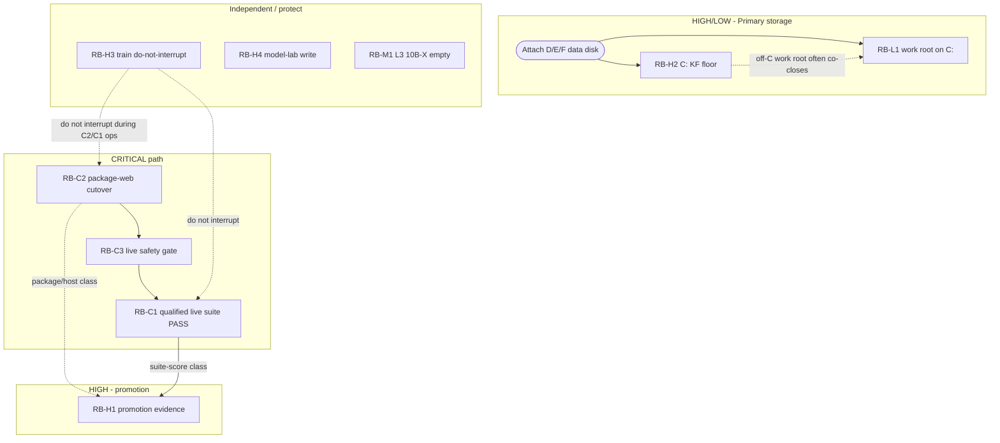

# Remaining blockers — dependency graph

**As of:** 2026-08-03  
**Scope:** Existing IDs only (RB-C1…C3, H1…H4, M1, L1) — no new categories  
**Source:** `AURICRUX_REMAINING_BLOCKERS.md` + verified closure plans  
**Does not claim:** any blocker closed by this document alone  

---

## Severity map

| ID | Severity | One-line |
|----|----------|----------|
| RB-C1 | CRITICAL | Live suite authority FAIL 76.7% |
| RB-C2 | CRITICAL | Package not proven on product host |
| RB-C3 | CRITICAL | Live deployment safety gate blocked (SG-20) |
| RB-H1 | HIGH | Promotion evidence blocked |
| RB-H2 | HIGH | C: free &lt; 50 GB KF floor |
| RB-H3 | HIGH | Live 3B train do-not-interrupt (protect) |
| RB-H4 | HIGH | model-lab not writable (Michael RX) |
| RB-M1 | MEDIUM | L3 empty 10B→X (tier promote only) |
| RB-L1 | LOW | Work root still on C: |

---

## Graph (edges = “must close / clear before”)



Solid arrows = hard dependency. Dotted = soft constraint or partial contribution.

---

## Root blockers

Blockers with **no hard predecessor** in this set (can be worked first, subject to soft constraints):

| Root | Why root | Soft constraints |
|------|----------|------------------|
| **RB-C2** | Cutover is the critical-chain entry; offline package already prepared | Do not touch train (H3); C: floor (H2) does **not** block remote cutover |
| **RB-H2** | Storage floor; needs disk/reclaim — not caused by C1–C3 | Parallel to critical path |
| **RB-H3** | Time/process root — waits on train completion; not “fixed” by cutover | Protects all GPU-local work |
| **RB-H4** | ACL/identity — independent of host package | Needed before model-lab `-Apply` only |
| **RB-M1** | Content authoring for higher tiers — independent of 3B live path | — |
| **Disk attach** (enabler, not a blocker ID) | Unlocks H2 structural path + L1 | Shared prerequisite for H2/L1 durable close |

**RB-L1** is not a pure root: it **depends on a non-C volume** (same enabler as H2). Without disk, L1 cannot close.

---

## Dependent blockers

| Blocker | Depends on | Nature |
|---------|------------|--------|
| **RB-C3** | **RB-C2** | Hard — live gate FAIL is SG-20 = package-host consistency |
| **RB-C1** | **RB-C3** (and thus C2) | Hard — authoritative suite requires live gate; also needs qualified ≥80% result after entry |
| **RB-H1** | **RB-C2** (package/host) + **RB-C1** (suite score) | Hard for full `PROMOTION_EVIDENCE_OK`; partial PG fails clear stepwise |
| **RB-L1** | Non-C volume (shared with H2 remediation) | Hard for physical relocate; env alone insufficient today (no D:/E:/F:) |

---

## Blockers that disappear (or auto-clear) when others close

| Blocker | Disappears / auto-clears when | Notes |
|---------|------------------------------|-------|
| **RB-C3** | **RB-C2** closes (`PACKAGE_HOST_CONSISTENCY_OK`) | SG-20 should flip; re-assert live gate — typically **no separate deploy** |
| **RB-H1** (partial) | **RB-C2** closes | Package/host/runtime-truth promotion classes improve; **suite FAIL remains** until C1 |
| **RB-H1** (full) | **RB-C1** + **RB-C2** (+ gate) | Full `PROMOTION_EVIDENCE_OK` |
| **RB-L1** (often) | Data disk + work-root env as part of **RB-H2** remediation | Same disk work co-closes L1 if `onPrimaryC=false` |
| Live drift WARN (not a listed ID) | **RB-C2** | ProbeLive host identity WARN expected until cutover |

**Does not auto-clear:**

| Blocker | Remains after critical path |
|---------|----------------------------|
| RB-H2 | Until free ≥50 GB / policy OK |
| RB-H3 | Until train leaves `running-do-not-interrupt` |
| RB-H4 | Until write probe / Apply path proven |
| RB-M1 | Until L3 authored for 10B→X |
| RB-C1 | Closing C2/C3 only **enables** suite; score must still PASS |

---

## Shortest path to **zero CRITICAL** blockers

Critical set = **{RB-C1, RB-C2, RB-C3}** only.

```text
1. RB-C2  — execute package-web cutover (execution package + PostVerify)
            [H3: do not touch train; H2: not required for remote cutover]
2. RB-C3  — re-run live safety gate  → expect auto-clear with C2
3. RB-C1  — authoritative suite rerun package must be GO, then dated live suite
            → qualified PASS (≥80, packageIdentity, zero fallback contamination)
            → ledger currentLiveAuthority update
```

**Minimum operator sequence (critical only):**  
**C2 → (C3 verify) → C1 suite.**

That is the shortest critical path: **3 steps**, with C3 usually a **verify**, not a separate project.

### Explicitly not on the shortest critical path

| ID | Why deferred for “zero critical” |
|----|----------------------------------|
| RB-H1 | HIGH — closes after C1+C2; not CRITICAL severity |
| RB-H2 / RB-L1 | Storage — not required for remote cutover/suite |
| RB-H3 | Protect-only during path; closes on natural train end |
| RB-H4 | Lab sync — not required for C2/C1 product-host suite |
| RB-M1 | Higher-tier L3 — not 3B live CRITICAL |

---

## Parallel work (does not lengthen critical path)

While waiting on cutover authorization or suite runtime:

| Track | Blockers | Benefit |
|-------|----------|---------|
| Storage | H2 (+ L1 with same disk) | Local import headroom; not critical-path |
| Lab ACL | H4 | Sync Apply readiness |
| L3 content | M1 | Future tier promote |
| Train | H3 | Observe only — no interrupt |

---

## After zero CRITICAL — next severity target

```text
CRITICAL cleared
  → RB-H1 (promotion)     [depends on C1+C2]
  → RB-H2 / RB-L1          [disk]
  → RB-H4                  [Apply as Auricrux]
  → RB-M1                  [L3]
  → RB-H3                  [natural train completion]
```

---

## Receipt

- Doc: `docs/runtime-proof/REMAINING_BLOCKERS_DEPENDENCY_GRAPH.md`  
- JSON: `docs/runtime-proof/remaining-blockers-dependency-graph-latest.json`
